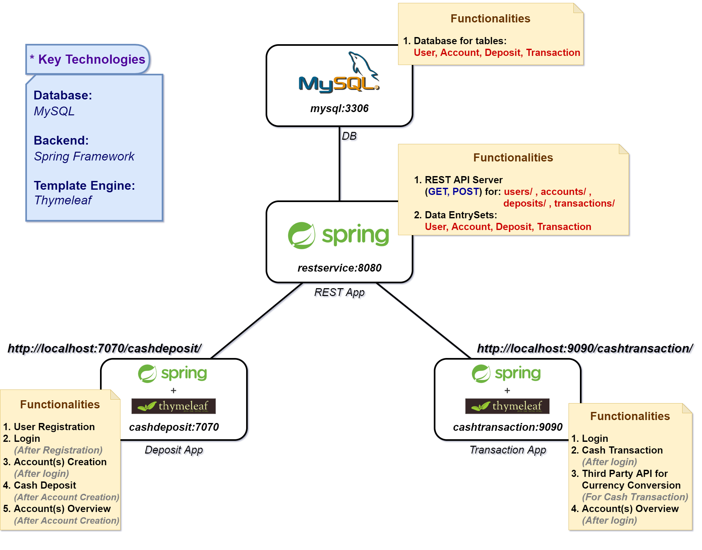

# Account Management System

The figure below illustrates the entire schema of the account management system.

## [1. MySQL Docker](https://github.com/junh-ki/account-management/tree/main/mysql-docker)

In `./mysql-docker/`, the `Dockerfile` that initializes MySQL with the Entity-Relationship Model (ERM) for this project and the SQL script for the MySQL testbench are introduced.

## [2. REST Service](https://github.com/junh-ki/account-management/tree/main/restservice)

In `./restservice/`, a REST Controller application that provides RESTful APIs is introduced. **The available REST APIs that have been implemented for the project are documented here**.

## [3. Cash Deposit](https://github.com/junh-ki/account-management/tree/main/cashdeposit)

In `./cashdeposit/`, a REST client application that interacts with users is intoduced. This app supports user registration & login, account creation, account overview, and cash deposit.

## [4. Cash Transaction](https://github.com/junh-ki/account-management/tree/main/cashtransaction)

In `./cashtransaction/`, a REST client application that interacts with users is intoduced. This app supports login, account overview, and cash transaction using **a third-party API for currency conversion**.

## [Docker Compose Deployment](https://github.com/junh-ki/account-management/tree/main/docker-compose)

In `./docker-compose/`, **a simple deployment methodology** using Docker Compose is introduced.
